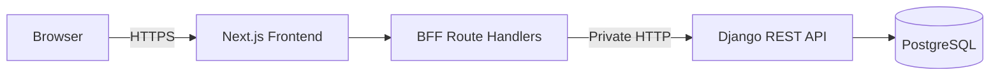

# FlowBoard

A production-deployed full-stack project management application with an ordered Kanban workflow.

[](https://github.com/ldmrtnll-arch/flowboard/actions/workflows/ci.yml)

**Status:** Deployed · Active portfolio project

[Live application](https://frontend-production-29dc.up.railway.app) ·
[Swagger UI](https://backend-production-a62ad.up.railway.app/api/docs/) ·
[ReDoc](https://backend-production-a62ad.up.railway.app/api/redoc/)

Create an account through the live application to explore the complete workflow. No shared demo credentials are published.

## Overview

FlowBoard helps an authenticated user organize client work as projects and tasks. Its main interaction is a persistent Kanban board that supports ordering within a column and moves across workflow stages.

The project demonstrates a production-oriented boundary between a Next.js web application and a Django REST API. Browser requests pass through a Backend for Frontend (BFF), while ownership rules, validation, and ordering invariants remain enforced by the backend.

## Features

- Account registration, login, refresh, logout, and authenticated profile lookup
- Private client, project, and task management
- Project planning with start dates, due dates, and status
- Fixed-column Kanban board with drag-and-drop ordering
- Persisted task moves within and across columns
- Responsive browser interface with validated forms
- Interactive Swagger and ReDoc API documentation
- Isolated end-to-end environment for realistic browser testing

## Architecture



Next.js serves the interface and same-origin BFF route handlers. JWT access and refresh tokens are stored in HttpOnly cookies; browser JavaScript never reads tokens or calls Django directly. In production, Railway provides public HTTPS for the frontend, private networking between application services, and a private PostgreSQL connection.

## Tech Stack

| Layer | Technology |
| --- | --- |
| Frontend | Next.js 16, React 19, TypeScript, Tailwind CSS |
| Forms and validation | React Hook Form, Zod |
| Drag and drop | dnd-kit |
| Backend | Python 3.12, Django 5, Django REST Framework |
| Authentication | Simple JWT, HttpOnly BFF cookies |
| Database | PostgreSQL 18 |
| API contract | OpenAPI, drf-spectacular, Swagger UI, ReDoc |
| Runtime | Docker, Gunicorn, WhiteNoise |
| Quality | Pytest, ESLint, TypeScript, Playwright |
| Delivery | GitHub Actions, Railway |

## Domain Model

```text
User
└── Clients
    └── Projects
        └── Tasks
```

A user owns every business resource in their hierarchy. Each project belongs to one of the owner's clients. Each task belongs to a project and carries a workflow `status` plus a server-managed integer `position` that determine its Kanban column and order.

## Business Rules

- Every query is scoped to the authenticated user.
- A resource owned by another user is returned as `404 Not Found`, avoiding existence disclosure.
- A project can reference only a client owned by the same user.
- A project due date cannot be earlier than its start date.
- A client with projects and a project with tasks cannot be deleted; the API returns `409 Conflict`.
- A task assignee is either the resource owner or `null`.
- Kanban positions are controlled by the server, not ordinary task updates.
- Moves and reorders are atomic so partially updated board state is never persisted.

## Authentication

The application request path is `Browser -> Next.js BFF -> Django`. Login and refresh responses are converted by the BFF into access and refresh cookies configured as HttpOnly and `SameSite=Lax`; production cookies are also `Secure`.

Client-side JavaScript does not receive JWT values. Protected Next.js route handlers attach the access token when calling Django, attempt a refresh when appropriate, and return a same-origin response to the browser.

Swagger is intended for developer exploration of the backend contract. Its authorization flow uses a bearer access token entered explicitly in the documentation interface and is separate from the browser application's cookie handling.

## Kanban

Every project board has five fixed columns:

1. Backlog
2. To do
3. In progress
4. Review
5. Done

Tasks can be reordered within one column or moved between columns. The backend clamps requested positions, updates affected tasks transactionally, and returns the persisted result. The frontend applies an optimistic update for responsive interaction and rolls back if persistence fails. Reloading the board preserves the server-defined ordering.

## API Documentation

- [Live Swagger UI](https://backend-production-a62ad.up.railway.app/api/docs/)
- [Live ReDoc](https://backend-production-a62ad.up.railway.app/api/redoc/)
- [Versioned OpenAPI schema](docs/openapi.yaml)
- [API architecture and behavior](docs/api.md)

The OpenAPI schema is generated from Django and committed with the repository. CI regenerates and validates it, then fails when the versioned contract drifts from the implementation.

The main API groups are authentication, clients, projects, tasks, project boards, health, readiness, and documentation. The interactive documentation contains the complete operation-level reference.

## Testing

The current automated suite contains **123 backend tests** and **6 Playwright end-to-end tests**.

Backend coverage includes:

- User model, manager, authentication, and authorization behavior
- Client, project, and task models and CRUD endpoints
- Cross-user isolation and ownership-based `404` responses
- Date, relationship, deletion conflict, and assignee validation
- Kanban ordering, same-column reordering, and cross-column moves
- Health, readiness, database connectivity, and OpenAPI generation

The Playwright scenarios exercise the complete Next.js BFF, Django, and PostgreSQL stack. They cover authentication, the client-to-project-to-task workflow, board rendering, drag-and-drop movement, persisted ordering, and authorization boundaries.

Run backend tests from `backend/`:

```sh
python -m pip install -r requirements-dev.txt
pytest
```

Run the isolated browser suite from `frontend/` with Docker available:

```sh
npm ci
npx playwright install chromium
npm run test:e2e
```

The E2E runner creates a dedicated Compose project and disposable PostgreSQL volume, then removes those resources after the run. It does not use the local development database.

## CI/CD

Pull requests to `main` and pushes to `main` trigger GitHub Actions:

```text
Backend checks ─┐
                ├──> Playwright E2E ──> CI success ──> Railway deployment
Frontend checks ┘
```

The backend job starts PostgreSQL, validates dependencies and Django settings, checks migrations, detects OpenAPI drift, and runs Pytest. The frontend job installs locked dependencies, lints, type-checks, and builds the production application. End-to-end tests run only after both jobs pass.

Railway native GitHub deployments have **Wait for CI** enabled. A merge that fails the workflow does not proceed to deployment; no Railway credential is stored in GitHub Actions.

## Deployment

Production runs on Railway in US East (Virginia):

- A public HTTPS Next.js standalone frontend
- A Django REST API served by Gunicorn
- Private HTTP from the frontend BFF to the backend
- A private managed Railway PostgreSQL service
- Platform-managed TLS and deployment health checks

The backend public domain exists for health endpoints and developer-facing API documentation. Normal application traffic uses the frontend BFF and private backend address. See the [deployment guide](docs/deployment.md) for the runtime model, variables, security settings, health checks, and rollback notes.

## Running Locally

### Docker Compose

Docker Compose is the shortest path to the complete stack.

```sh
git clone https://github.com/ldmrtnll-arch/flowboard.git
cd flowboard
cp .env.example .env
```

Edit `.env` and replace the placeholder PostgreSQL password, Django secret, and JWT signing key with independent local development values. Then start the services:

```sh
docker compose up --build
```

Default local endpoints:

- Application: [http://localhost:3000](http://localhost:3000)
- Backend API: [http://localhost:8000](http://localhost:8000)
- Swagger UI: [http://localhost:8000/api/docs/](http://localhost:8000/api/docs/)
- ReDoc: [http://localhost:8000/api/redoc/](http://localhost:8000/api/redoc/)

Stop the stack with `docker compose down`. The normal PostgreSQL named volume is retained unless it is explicitly removed.

### Manual Development

Start PostgreSQL with Docker, then run Django:

```sh
docker compose up -d db
cd backend
python -m venv .venv
# Activate .venv using the command for your shell and operating system.
python -m pip install -r requirements-dev.txt
python manage.py migrate
python manage.py runserver
```

In another terminal, configure and run Next.js:

```sh
cd frontend
cp .env.example .env.local
npm ci
npm run dev
```

The frontend example points its server-side BFF to the local Django address. Never add a `NEXT_PUBLIC_` prefix to the backend URL.

### Environment Variables

Use the committed root [`.env.example`](.env.example) for Docker and backend development, and [`frontend/.env.example`](frontend/.env.example) for a manually started frontend. Production variable responsibilities and security defaults are documented in [docs/deployment.md](docs/deployment.md). Do not commit populated environment files or secrets.

## Project Structure

```text
flowboard/
├── backend/                 Django API and domain applications
│   ├── users/               Account and authentication domain
│   ├── clients/             Client ownership and CRUD
│   ├── projects/            Projects and board reads
│   └── tasks/               Tasks and ordering transactions
├── frontend/                Next.js application and BFF
│   ├── src/app/             Pages and route handlers
│   ├── src/components/      Forms, layout, and Kanban UI
│   ├── src/lib/             API, auth, schemas, and types
│   └── e2e/                 Playwright scenarios and support
├── docs/                    API, OpenAPI, and deployment docs
├── .github/workflows/       Continuous integration
├── compose.yaml             Local full stack
└── compose.e2e.yaml         Isolated E2E infrastructure
```

## Technical Decisions

1. **Backend for Frontend:** browser traffic stays same-origin while Next.js owns session transport and Django remains the domain API.
2. **HttpOnly JWT cookies:** access and refresh tokens are unavailable to client-side JavaScript, with secure production cookie attributes.
3. **PostgreSQL everywhere:** development, testing, CI, and production exercise the same database engine and constraints.
4. **Ownership returns 404:** foreign resources are indistinguishable from missing resources to reduce information disclosure.
5. **Atomic Kanban ordering:** the backend owns positions and transactionally updates every affected row.
6. **Versioned OpenAPI contract:** generated schema drift is detected in CI and reviewed alongside implementation changes.

## Possible Future Improvements

The current MVP is complete and deployed. Potential post-MVP work includes:

- Team workspaces with explicit roles and invitations
- Activity history and audit events
- Notifications for assignments and due dates
- Observability dashboards and automated backup-restore drills
